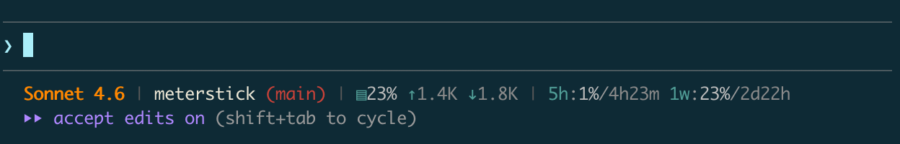

# Meterstick

## Claude Code Statusline for Macos

An enhanced statusline for Claude Code that displays model info, directory, git branch status, context usage, and rate limit tracking with visual indicators.

## Features

- **Model Information**
  - Displays current Claude model (e.g., "Opus 4.6")
- **Directory Context**
  - Shows current directory (e.g., "meterstick")
- **Git Status**:
  - Branch name color-coded by dirty state (green = clean, red = uncommitted changes)
- **Context Status**
  - Current session's context usage percentage
  - Color-coded percentages (white < 50%, amber 50-80%, red ≥ 80%)
  - Token counts
- **Rate Limit Tracking**: Real-time usage with time-until-reset (requires Python 3)
  - Exact utilization % from Anthropic API via OAuth
  - 5-hour and 1-week rolling windows
  - Accurate reset times from server
  - Color-coded percentages (white < 50%, amber 80%, red ≥ 80%)

## Example Output




## Installation

### Prerequisites

**Required:**

- **jq** - JSON processor (for parsing JSON input/config)

**Optional (recommended):**

- **git** - Version control (for git branch status display)
  - Without git: Git section will be hidden

Install on macOS:

```bash
# Required
brew install jq

# Optional (recommended)
brew install git
```

### Install Steps

1. Clone or download this package
2. Run the installer:

   ```bash
   cd /path/to/meterstick
   ./install.sh
   ```
3. Restart Claude Code to activate the meterstick

## Configuration

The installer creates two configuration files:

### `~/.claude/meterstick-config.json`

```json
{
  "sections": ["model", "directory", "git", "context", "ratelimits"]
}
```

**Configuration Options:**

- **`sections`**: Array controlling section order and visibility

## How It Works

### Statusline Mechanism

Claude Code's statusline feature works as follows:

1. You configure a `statusLine.command` in `~/.claude/settings.json` pointing to a bash script
2. After each assistant message, Claude Code executes your script
3. The script receives JSON on stdin with model info, directory, context usage, session ID, etc.
4. The script outputs ANSI-colored text to stdout, which is displayed in the statusline
5. Execution is debounced at 300ms to avoid performance issues

### Rate Limit Tracking

Meterstick displays real-time rate limit data from Anthropic's OAuth API (requires Python 3).

**How It Works:**

1. Retrieves OAuth access token from macOS Keychain (`"Claude Code-credentials"`)
2. Calls `https://api.anthropic.com/api/oauth/usage` with authentication
3. Returns actual 5-hour and 7-day utilization percentages
4. Caches results for 30 seconds to minimize API calls

**Benefits:**

- ✓ Exact server-side utilization from Anthropic
- ✓ Model-aware rate limiting (Opus costs ≠ Haiku costs)
- ✓ Accurate reset timestamps
- ✓ Matches exactly what you see on claude.ai

**When OAuth is unavailable:**
If OAuth fails (Python not installed, credentials unavailable, network issues), the rate limit section is hidden. All other sections continue to work normally.

**Privacy & Security:**

- Token is retrieved from secure macOS Keychain
- OAuth token never leaves your machine except to call Anthropic's API
- All communication uses HTTPS
- Cache file (`/tmp/claude-oauth-usage-cache.json`) contains only public usage percentages
- No credentials are ever written to disk

**Performance:**

- Cached responses: ~70ms
- API call: ~150ms (well within 300ms debounce)
- Timeout protection: 1-second max (prevents hanging)
- Rate limited: Max ~2 API calls/minute (30-second cache)

## Uninstallation

To remove the meterstick:

```bash
cd /path/to/meterstick
./uninstall.sh
```

This will:

- Remove `statusLine` configuration from `settings.json`
- Delete `~/.claude/meterstick-command.sh`
- Delete `~/.claude/meterstick-config.json`
- Clean `/tmp/claude-meterstick-cache`
- Optionally delete usage tracking data

Then restart Claude Code.

## Troubleshooting

### Meterstick not appearing

1. Check `~/.claude/settings.json` has:
   ```json
   {
     "statusLine": {
       "command": "/Users/yourusername/.claude/meterstick-command.sh",
       "debounceMs": 300
     }
   }
   ```
2. Verify script is executable: `chmod +x ~/.claude/meterstick-command.sh`
3. Restart Claude Code

### Git branch not showing

- Git section auto-hides when not in a git repository
- Check git is installed: `which git`
- If git is not installed, the git section will be hidden (this is normal)

### Rate limits not showing

- Ensure Python 3 is installed: `python3 --version`
- Rate limits require OAuth authentication (automatic if logged into Claude Code)
- If OAuth fails, the rate limit section is hidden (this is normal behavior)

## License

MIT License - Feel free to modify and distribute

## Contributing

Contributions welcome! Areas for improvement:

- Additional color themes
- Configurable output format
- More git status indicators (ahead/behind tracking)
- If you want to go big, windows and linux compatibility
